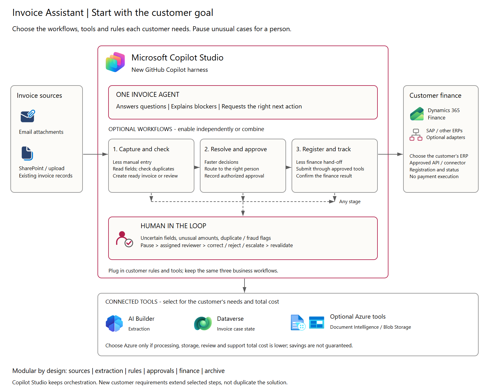

Invoice Assistant for Copilot Studio
===================================

A reusable, goal-led solution using the new GitHub Copilot harness in Copilot
Studio: one agent and up to three composable workflows. Version 0.3.0.

Architecture
------------

Start with the customer's outcome
--------------------------------

======================= =================================== ======================
Customer goal           Enable                              Measure
======================= =================================== ======================
Faster invoice answers  Agent with read-only tools          Time spent finding status
Less manual entry       Capture and check                   Minutes per invoice
Faster approvals        Resolve and approve                 Waiting time and follow-ups
End-to-end handling     Combine all three workflows         Cost per confirmed invoice
======================= =================================== ======================

The third workflow is Register and track. It can also connect to an existing
approved-invoice process without replacing the customer's intake or approvals.
Do not deploy every module by default.

Open ``docs/index.html`` for the short solution guide, tool-icon architecture,
value/cost calculator and setup instructions. The editable diagram is
``docs/architecture.excalidraw``.

